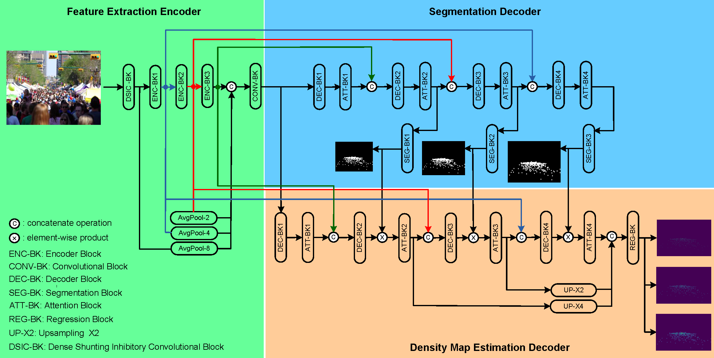
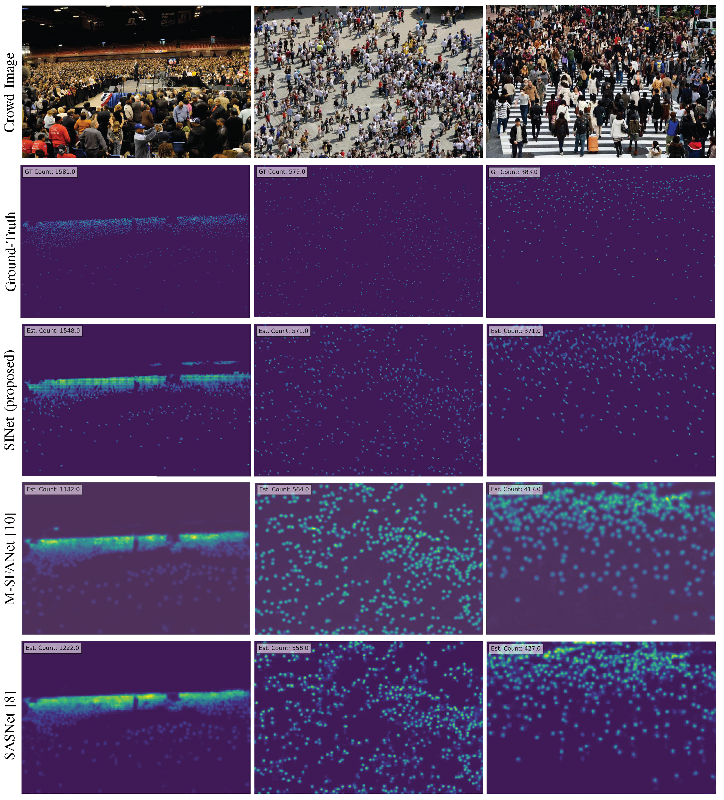

# SINet
## Description
<div align="justify">
We present a new deep learning model for crowd counting and introduce a novel processing unit, known as the Shunting Inhibitory (SI) neuron. The architecture of this network comprises an encoder and dual decoders. Each decoder is characterized by a sequence of alternating convolutional and transformer layers. Both the encoder and the decoders are composed of layers of SI neurons and perceptrons, which are used to generate accurate segmentation and density maps. The adoption of SI neurons is based on their ability to form more complex nonlinear decision boundaries compared to traditional perceptrons. This unique feature enables us to design a compact yet highly effective network architecture.
</div>

<br />


**Fig. 1.** SINet architecture with different network components for crowd density map estimation.


## Installation
1. Install pytorch

2. git clone https://github.com/ftivive/SINet/

3. Install dependencies: `pip install -r requirements.txt`


## Train and test
1. To train a SINet network, run the following command:

**Example 1:** `python train.py`

2. To test a pretrained SINet network, run the following command:

**Example 1:** `python test.py --input images/test_image.jpg --output images/test_image-output.jpg`


## Results on ShanghaiTech dataset
| **Part-A MAE** | **Part-A RMSE** | **Part-B MAE** | **Part-B RMSE** |
|:------------:|:-------------:|:------------:|:-------------:|
| 52.3    | 87.6      | 6.0      | 10.1       |


## Visualization


## Citation
If you find this work or code is helpful for your research, please cite:
```
@ARTICLE{,
  author={F. H. C. Tivive, A. Bouzerdoum, S. L. P., H. T. Le, and H. Baali},
  journal={}, 
  title={A deep learning-based method for crowd counting using shunting inhibition mechanism}, 
  year={},
  volume={},
  number={},
  pages={},
  doi={}}
  ```
## Reference

