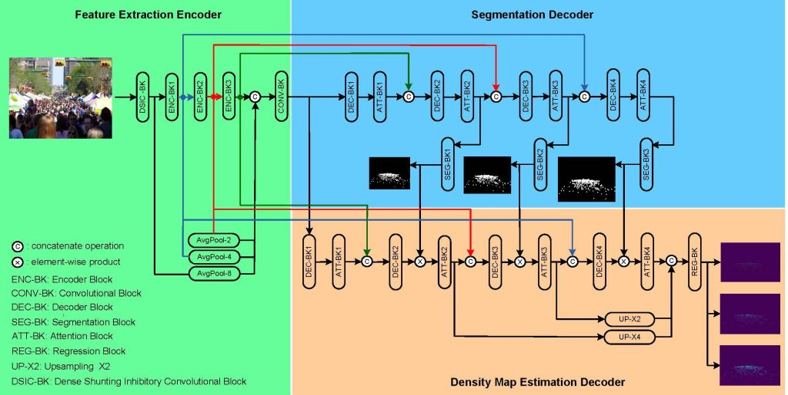

# SINet
## Description
We introduce a novel network architecture and processing unit, referred to as the shunting inhibitory (SI) neuron, for crowd counting. The network consists of an encoder and two decoders, where the latter is characterized by a sequence of alternating convolutional and transformer layers. This design captures rich contextual information that is used for generating accurate segmentation and density maps. The SI neuron is more powerful than the traditional perceptron because it has the capability to generate more complex decision boundaries. 



**Fig. 1.** SINet architecture with different network components to estimate the crowd density map.


## Results on ShanghaiTech dataset

| **Methods**         |    **Part-A**      |     **Part-B**     |
| --------------------|---------|----------|---------|----------|
|                     | **MAE** | **RMSE** | **MAE** | **RMSE** |
| SINet               |         |          |         |          |


## Visualization


## Citation
If you find this work or code is helpful for your research, please cite:
```
@ARTICLE{,
  author={F. H. C. Tivive, A. Bouzerdoum, S. L. P., H. T. Le, and H. Baali},
  journal={}, 
  title={A deep learning-based method for crowd counting using shunting inhibition mechanism}, 
  year={},
  volume={},
  number={},
  pages={},
  doi={}}
  ```
## Reference

